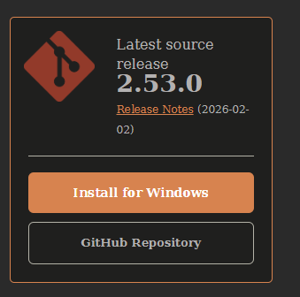
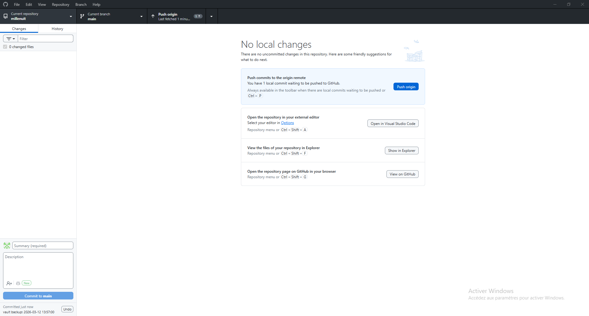

## Installation de git et git desktop
Git permettras de modifier notre documentation sur un depot local, de la pousser sur un depot publique et de la partager a l'aide d'un lien avec github pages.
### Installation de git
L'installation de Git est plutôt simple et directe, il suffit de suivre le processus d'installation a partir du fichier d'installation disponible sur le site officiel



### Installation de github desktop 
Github desktop rendras plus facile la gestion du dépôt mais celle ci n'est pas nécessaire.
Similairement il suffit d'utiliser le fichier de téléchargement officiel et de se connecter a son compte github afin d'avoir accès a ses dépôts.


Nous avons maintenant accès a github et a nos dépôts publiques



## Installation d'obsidian

Obsidian sert d'éditeur de texte en markdown pour nous faciliter la création de la documentation, il permettras aussi d'effectuer le lien avec git a l'aide d'une extension et de pull, commit et push automatiquement nos documentations pour être sur qu'elle soit toujours a jour.

Comme le reste des applications l'installation d'obsisian se fait a travers le fichier d'installation disponible sur leur site officiel


## Mise en place d'Mkdocs

Mk docs est l'outil qui permettras de transformer le coffre fort obsidian markdown en site statique html.

Si l'ordinateur possède une version récente de python la commande est la suivante:

`python -m pip install mkdocs python -m mkdocs`

celle si nous permettras d'installer mkdocs.
Ensuite:

`python -m mkdocs`

nous permettras de lancer mkdocs pour vérifier son bon fonctionnement.

l'installation étant terminée il faut créer un dossier pour le markdown et s'y déplacer avec ces commande:

`python -m mkdocs new my-project`
`cd my-project`

Ceci vas créer un fichier yml et md il suffiras de modifier son fichier 


## Création d'un dépot github

## 
```
Ar
```

