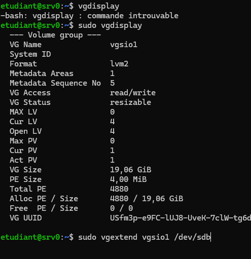
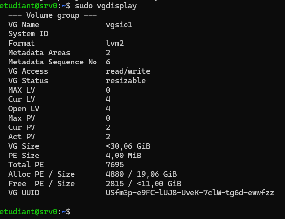
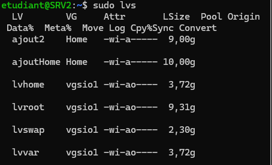
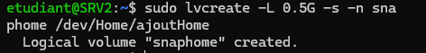

## Ajout d'un nouveau disque avec LVM








## Création de snapshots pour volumes logiques 

Commencer par s'assurer qu'il reste de la place dans le groupe de volume avec la commande : 

```
sudo vgs
```

Ensuite nous allons identifier le volume logique pour lequel nous voulons créer un instantané :

```
sudo lvs
```

Normalement on voit apparaître : 


Ici nous voyons donc nos différents volumes logiques.
Je vais personnellement mettre au point un snapshot pour mon ajoutHome, grâce à la commande suivante : 

```
sudo lvcreate -L 0.5G -s -n snaphome /dev/Home/ajoutHome 
```

Nous voyons donc apparaitre ceci si tout fonctionne bien : 



A chaud si nous retournons sur un ancien snapshot, il est important de reboot


## OpenSSH

```
The authenticity of host 'serveur.example.com (192.168.1.10)' can't be established.
ECDSA key fingerprint is SHA256:...
Are you sure you want to continue connecting (yes/no/[fingerprint])? yes
```
 
1) Si ce type de message apparaît lors d'un première connexion, c'est normal, lors de la première connexion au serveur, le client enregistre la clé publique du serveur, pour ainsi vérifier l'identité du serveurs lors des prochaines connexions.

2) Donc forcément si nous avons répondu "yes" au préalable, ce message ne réapparaîtra plus, étant donné que nous avons déjà stocké sa clé publique.

3) `/etc/ssh/ssh_host_*` est l'emplacement où sont stockées les paires de clés.
		`ssh_host_ed25519_key` --> Clé privée Ed25519 (recommandée)
		`ssh_host_ed25519_key.pub` --> Clé publique Ed25519
		`ssh_host_rsa_key` --> Clé privée RSA (obsolète, à éviter)