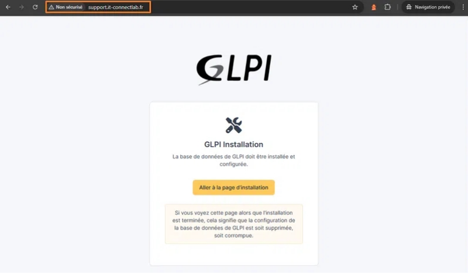
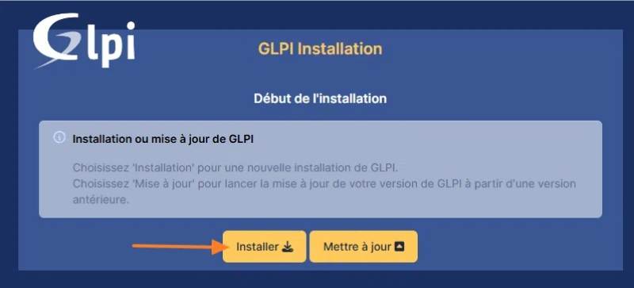
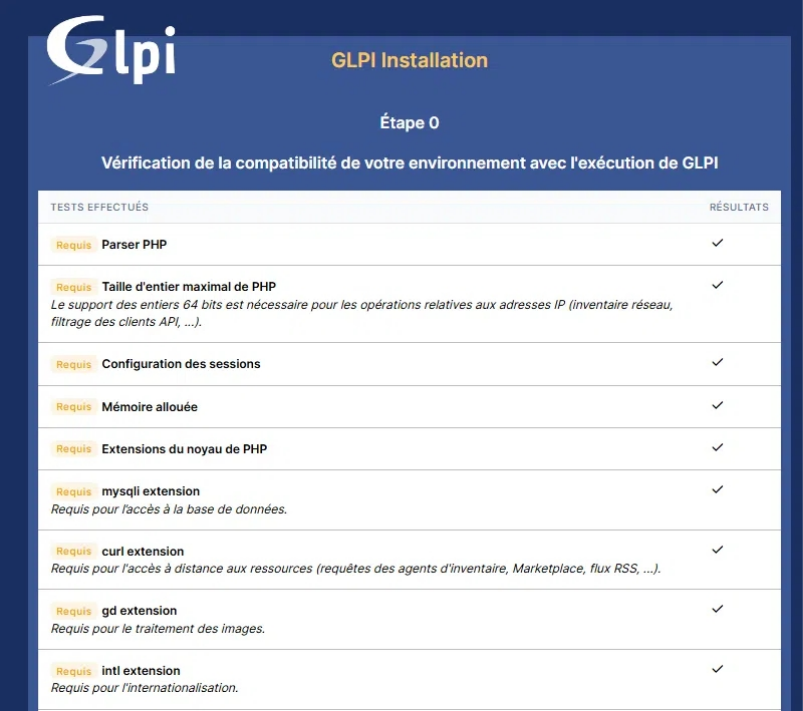
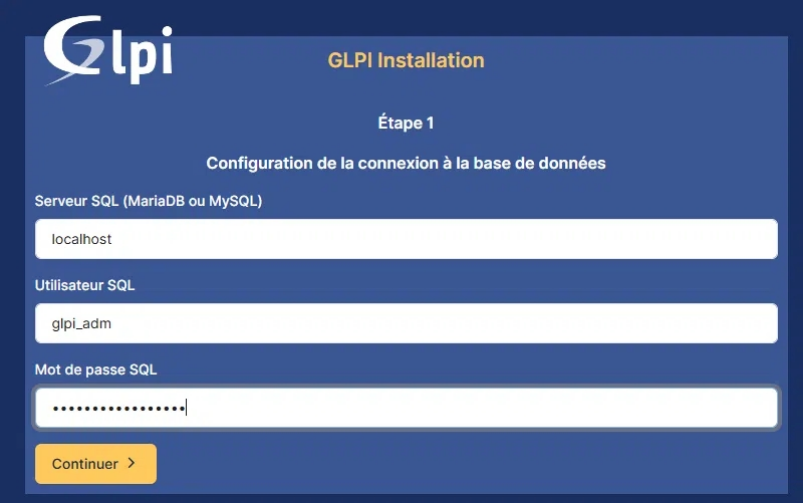
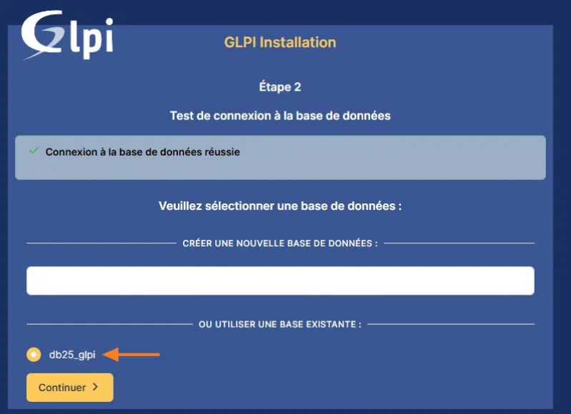

---
## 1 - Prérequis

**Php 8.2-fpm / mariadb / apache2 ainsi que les extensions php**

```
sudo apt-get update && sudo apt-get upgrade
sudo apt-get install apache2 php8.4-fpm mariadb-server
sudo apt install php8.4-{curl,gd,intl,mysql,zip,bcmath,mbstring,xml,bz2}
```


## 2 - Création de la base de données pour GLPI

```
sudo mariadb-secure-installation
sudo mysql -u root -p
```

```
CREATE DATABASE db_glpi;
GRANT ALL PRIVILEGES ON db_glpi.* TO 'glpi_adm'@localhost IDENTIFIED BY
'MotDePasseRobuste';
FLUSH PRIVILEGES;
EXIT;
```

## 3 - Télécharger et déployer GLPI

```
cd /tmp
wget https://github.com/glpi-project/glpi/releases/download/|VERSION|/glpi-
|VERSION|.tgz
sudo tar -xzvf glpi-|VERSION|.tgz -C /var/www/
```

*remplacer |VERSION| par la version de glpi souhaitée

## 4 - Organiser les répertoires, permissions et configuration

```
sudo chown www-data /var/www/glpi/ -R
```

```
sudo mkdir /etc/glpi
sudo chown www-data /etc/glpi/
sudo mv /var/www/glpi/config /etc/glpi
```

```
sudo mkdir /var/lib/glpi
sudo chown www-data /var/lib/glpi/
sudo mv /var/www/glpi/files /var/lib/glpi
```

```
sudo mkdir /var/log/glpi
sudo chown www-data /var/log/glpi
```

**Création de deux fichiers :**

```
sudo nano /var/www/glpi/inc/deownstream.php
```

**contenant :**

```
<?php
define('GLPI_CONFIG_DIR', '/etc/glpi/');
if (file_exists(GLPI_CONFIG_DIR . '/local_define.php')) {
require_once GLPI_CONFIG_DIR . '/local_define.php';
}
```

**et**

```
sudo nano /etc/glpi/local_define.php
```

**contenant**

```
<?php
define('GLPI_VAR_DIR', '/var/lib/glpi/files');
define('GLPI_LOG_DIR', '/var/log/glpi');
```

## 5 - Configuration d'Apache2 pour GLPI

**Création d'un fichier**

```
sudo nano /etc/apache2/sites-available/support.it-
connectlab.fr.conf
```

**contenant :**

```
<VirtualHost *:80>
ServerName glpi.mondomaine.tld # à adapter
DocumentRoot /var/www/glpi/public
<Directory /var/www/glpi/public>
Require all granted
RewriteEngine On
RewriteCond %{HTTP:Authorization} ^(.+)$
RewriteRule .* - [E=HTTP_AUTHORIZATION:%{HTTP:Authorization}]
RewriteCond %{REQUEST_FILENAME} !-f
RewriteRule ^(.*)$ index.php [QSA,L]
</Directory>
</VirtualHost>
```

**Puis activer le site :**

```
sudo a2ensite glpi.conf
sudo a2dissite 000-default.conf
sudo a2enmod rewrite
sudo systemctl restart apache2
```

## Configuration de la suite via l'interface Web











Nous devons renseigner les informations pour se connecter à la base de données.
Nous indiquons localhost en tant que serveur SQL puisque MariaDB est installé en
local, sur le même serveur que GLPI. Puis, nous indiquons notre utilisateur glpi_adm
et le mot de passe associé.


