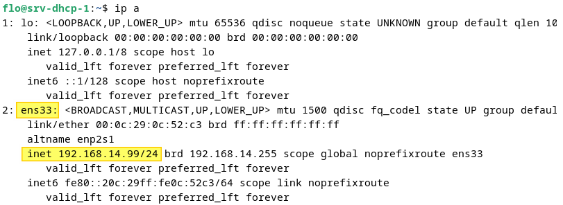

## Prérequis

Avant toute installation vérifiez bien de remplir tout ces critères :
	- Une machine Debian avec une adresse IP fixe 
	- Aucun autre serveur DHCP actif sur le réseau afin d'éviter les conflits
	- Au moins une machine cliente sans configuration IP afin de tester le serveur DHCP
	- Une connexion internet afin de télécharger les paquets d'installation 

## Installation du serveur DHCP KEA

La première étape consiste à effectuer la mise à jour du cache des paquets du système et à installer le paquet correspondant au serveur DHCP IPv4 :

```
sudo apt-get update  
sudo apt-get install kea-dhcp4-server
```

Vous pouvez ensuite vérifier l'état du service : 

 ```
 sudo systemctl status kea-dhcp4-server
 ```

## Configuration du serveur DHCP KEA

À partir de la console, affichez la configuration IP de votre machine pour identifier le nom de l'interface réseau. Dans cet exemple, il s'agit de l'interface nommée "**ens33**".

```
ip a
```

en image : 



Nous allons partir sur un fichier de configuration vierge, car le fichier d'origine contient beaucoup d'informations. Nous allons renommer le fichier de configuration par défaut, car il peut être utile afin d'avoir un exemple :

```
sudo mv /etc/kea/kea-dhcp4.conf /etc/kea/kea-dhcp4.conf.bkp
```

Puis, créez et éditez le fichier de configuration du serveur DHCP via cette commande :

```
sudo nano /etc/kea/kea-dhcp4.conf
```


```
{
    "Dhcp4": {
        "interfaces-config": {
            "interfaces": [
                "ens33"
            ]
        },
        "valid-lifetime": 691200,
        "renew-timer": 345600,
        "rebind-timer": 604800,
        "authoritative": true,
        "lease-database": {
            "type": "memfile",
            "persist": true,
            "name": "/var/lib/kea/kea-leases4.csv",
            "lfc-interval": 3600
        },
        "subnet4": [
            {
                "subnet": "192.168.14.0/24",
                "pools": [
                    {
                    //ici la plage ip
                        "pool": "192.168.14.100 - 192.168.14.120"
                    }
                ],
                "option-data": [
                    {
                        "name": "domain-name-servers",
                        "data": "192.168.14.201"
                    },
                    {
                        "name": "domain-search",
                        "data": "nom de domaine"
                    },
                    {
                    //passerelle
                        "name": "routers",
                        "data": "192.168.14.2"
                    }
                ]
            }
        ]
    }
}
```

Quand la configuration est prête, enregistrez le fichier et relancez le service du serveur DHCP :

```
sudo systemctl restart kea-dhcp4-server.service
```

**La configuration est maintenant terminée.** Vous pouvez effectuer un test dès maintenant.

Si le serveur DHCP ne démarre pas, vérifiez les journaux. Vous pouvez utiliser cette commande :

```
sudo journalctl -xe | grep -e kea
```

## Vérifications 

```
cat /var/lib/kea/kea-leases4.csv
```

Il y a bien un bail DHCP dans la base de données du serveur. La première ligne correspond aux en-têtes du fichier CSV, tandis que la seconde correspond au bail DHCP de la machine "**Ubuntu2404**".

```
address,hwaddr,client_id,valid_lifetime,expire,subnet_id,fqdn_fwd,fqdn_rev,hostname,state,user_context
192.168.14.100,00:0c:29:0a:6f:c3,01:00:0c:29:0a:6f:c3,691200,1733931089,1,0,0,ubuntu2404,0,
```
 et 
 
 ``` 
sudo systemctl status kea-dhcp4-server
 ```


## Création de plusieurs plages pour nos sous réseaux


## Mise en place d'un agent relais DHCP

L'agent relais DHCP est indispensable pour rediriger les utilisateurs sur le bon sous réseau et ainsi pouvoir leurs fournir les IP correspondantes.

Faire ceci pour chaque interfaces/sous-interfaces (mettre l'ip de notre serveur DHCP) :

```
Router(config-if)#ip helper-address 10.255.255.253
Router(config-if)#no shutdown # On active l’interface
Router(config-if)#exit
Router(config)#exit
```
